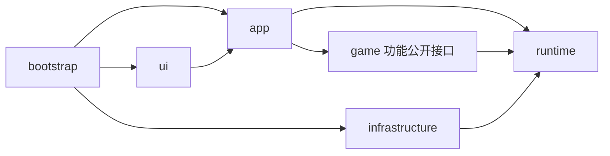

# 岛屿玩法助手架构规划

[文档目录](../README.md) · [当前代码指南](../development/guide.md) · [源码审视与 Python 项目参考](../reference/python-project-architecture.md)

状态：2026-09-08 已完成首轮架构实施。本文保留完整目标与扩展方向；已经落地的结构和命令以[开发指南](../development/guide.md)为准。本文取代先前以全局 `application/domain/adapters` 四层为主的方案。

已落地：根目录 bd2_fishing 应用包与构建配置，app/game/perception/runtime/infrastructure/ui 职责归类，utils/operate/OCR 混合模块拆分，反馈与结算规则独立，证据写入模块持有队列和线程，桌面服务及可注入截图工厂。原 122 项测试及 4 项架构回归通过，Tk 模拟检查、wheel 和 PyInstaller 构建通过。

仍属目标：完整页面导航、稳定岛屿身份与覆盖清单、组合机制决策、所有设备边界注入、完整任务快照接口、端到端时延基线。默认配置单源化、依赖锁定和运行数据迁移已在[统一布局](repository-layout.md)中实施。当前保留兼容的地点枚举、INI 和原输入时序。部分 game 执行模块仍直接使用基础设施；下文严格依赖图是继续收敛的目标，不能把首轮职责拆分当成全部实现。

## 1. 产品边界与设计原则

目标是 BrownDust II 的岛屿玩法助手。钓鱼是目前已经实现的主要能力；扩展包括从开始页进入玩法、岛屿选择、玩法信息读取，以及更多钓鱼机制。其他岛屿功能在需求和游戏画面明确后纳入同一应用，不预设为多游戏自动化平台。

用户提供的对应游戏封面显示标题 **Fishing Voyage**，原图与画面信息见[封面与页面参考](../reference/fishing-voyage.md)。该样本带有加载进度；后续导航须区分封面/加载状态与实际可操作页面，不能据此假定完整入口路线已知。

用户指出游戏已有 6 个岛屿，而代码只登记了 5 个地点。这是当前覆盖不足的线索，不应将数字改成 6 后再次固定上限。第六个岛屿的名称、入口、机制和支持情况需要另行核实；本文不凭搜索猜测补入游戏资料。

采用单进程、按功能组织的模块化架构，共享任务运行能力与设备实现。划分依据是概念归属、修改范围和资源所有权。抛竿、等待、QTE、结算等步骤留在钓鱼能力内部，运行流程不决定顶层目录。

岛屿资料不等于玩家当前状态，玩家状态不等于自动化支持范围。游戏识别逻辑也不等于 OCR 引擎：识别“当前岛屿”和识别“是否处于冰冻机制”分别属于对应玩法，通用引擎只负责从图像获取文字或像素特征。

## 2. 当前代码给出的约束

| 源码现状 | 架构需要解决的问题 |
| --- | --- |
| `ocr/ocr_enum.py` 的 5 项 `FishingLocation` 使用中文名称作为值 | 地点身份、显示文案和 OCR 别名解耦；不让 OCR 模块拥有岛屿模型 |
| `main.py` 按地点选择两个 QTE 策略类 | 地点与机制支持分别描述，不能由地点映射推导全部机制已覆盖 |
| `operate.change_location` 主要执行往返刷新 | 刷新用例与通用页面导航、岛屿选择分开，不能声称已经支持从开始页出发 |
| `qte_strategy.py` 混合采样、识别、决策与输入 | 在钓鱼功能内部建立可回放的识别和决策边界 |
| `qte_feedback.py`、`catch_result.py` 混合规则、线程与文件写入 | 玩法判定归功能，资源生命周期归运行会话，证据写入归基础设施 |
| `utils.py` 混合配置、日志、几何、截图和窗口保护 | 按明确职责拆解，避免搬成另一个万能工具包 |
| 工具用 monkeypatch 截图、输入甚至 sleep 进行录制或限时 | 正式入口与工具使用相同任务服务，可注入录制设备、时钟与证据接收器 |

这里是职责审视，不是新增的实机故障结论。现有机制与验证限制继续以[机制参考](../reference/fishing-mechanics.md)为准。

## 3. 目标 Python 包结构

```text
repository/
├── pyproject.toml              包元数据、直接依赖与工具配置
├── main.py                     桌面薄入口
├── scripts/build_release.py    便携包构建入口
├── README.md / AGENTS.md
├── bd2_fishing/
│   ├── __init__.py              无设备初始化或启动副作用
│   ├── bootstrap.py             组装具体实现
│   ├── app/                     用户任务、跨功能协调、状态展示接口
│   ├── game/                    本游戏的知识、识别和操作能力
│   │   ├── islands/             岛屿资料、地点身份、状态读取与选择
│   │   ├── navigation/          游戏页面识别、已知转换与到达确认
│   │   ├── fishing/             钓鱼识别、机制、决策、动作与结果
│   │   └── inventory/           背包信息与清理能力
│   ├── perception/              通用图像、OCR 读取及文字处理
│   ├── runtime/                 取消、会话、输入互斥及最小设备合同
│   ├── infrastructure/          Windows、截图、OCR、配置与记录实现
│   └── ui/                      Tk 页面、设置与结果展示
├── tests/                       单元、回放、集成、真实样本
├── scripts/checks、live/         检查与实机工具
├── requirements/                完整 Windows 依赖锁定
├── docs/                        使用、开发、游戏参考与历史
└── .github/workflows/           离线验证和 Windows 构建
```

这是目标职责图，不要求立即建立所有目录或空类。小功能可先是一个模块，钓鱼已有足够规模才拆成包。包名暂保留 `bd2_fishing`，产品范围扩大不要求同一次迁移改变仓库名、安装名和用户 EXE 名称。

独立桌面应用采用 flat layout：bd2_fishing 位于仓库根目录，统一包名服务于内部模块导入。构建显式只收集应用包；工具可通过可编辑安装从任意工作目录调用，wheel 用于校验安装和资源完整性。[PyPA 布局说明](https://packaging.python.org/en/latest/discussions/src-layout-vs-flat-layout/)

## 4. 各部分职责与依赖

本节严格设备注入图仍是后续目标。当前实际允许的导入方向和自动检查规则以[开发规范](../development/standards.md)为准：动作与观察器允许使用具体适配器，runtime/perception/纯规则不得反向依赖游戏执行实现。

| 部分 | 拥有的职责 | 对外边界 |
| --- | --- | --- |
| `app` | 开始/停止任务、任务请求与结果、跨功能协调 | UI 和工具统一调用；不直接调用驱动 |
| `game.islands` | 岛屿目录、地点与玩法关联、可用性读取、岛屿选择操作 | 提供资料查询和选择能力，不自行启动钓鱼 |
| `game.navigation` | 当前游戏页面与遮挡状态识别、合法页面转换、超时与到达验证 | 提供到达指定已知页面的能力，不决定用户应去哪个岛 |
| `game.fishing` | 上钩、QTE、机制观察、策略、抛竿恢复、反馈与整条鱼结果 | 在前置条件满足时执行钓鱼；返回明确结果及后续需求 |
| `game.inventory` | 背包读取、满包状态、明确的清包操作 | 读取与出售为独立操作，清包开关由任务政策执行 |
| `runtime` | 取消、输入锁、会话资源管理、时间/帧/设备的最小合同 | 不含岛屿名单或 QTE 策略 |
| `infrastructure` | DXcam/GDI、Windows 窗口与输入、RapidOCR、配置持久化、证据写盘 | 实现合同，不决定游戏任务与成功条件 |
| `ui` | 用户设置、能力覆盖展示、任务和信息展示 | 只通过 app 获取运行状态与提交操作 |

以下箭头表示允许的 Python 导入依赖，不表示游戏执行顺序：



`game` 不导入 `app`、`ui` 或具体设备模块。功能之间只依赖明确的公开接口：岛屿选择可以调用 navigation；跨钓鱼、背包和导航的流程由 app 协调，避免互相调用内部 runner。共享的小型游戏标识可提取成独立模型模块，但不建立持有所有状态的全局对象。

`infrastructure` 保存通用设备与存储数据；游戏特有证据先由所属功能转换为带版本的记录。配置格式转换在 app 组装时连接到功能自己的设置类型，避免基础设施反向导入玩法执行代码。

只有实际需要替换或隔离副作用的地方使用小型 Protocol，例如帧源、受控输入、OCR、时钟和证据接收器。普通识别函数无需包装成接口；不在每个功能内重复完整四层目录。

## 5. 岛屿、信息与支持范围的模型

### 岛屿资料

使用稳定的 `IslandId`，显示名称、语言别名、排序、入口资料、适用玩法和资料来源是其他字段。不能使用列表下标或中文名称作为持久化身份，也不写死岛屿总数。

岛屿与钓鱼地点是否一一对应需要依据实际游戏确认。若一个岛包含多个地点，再引入独立 `LocationId` 与所属关系；不能只把当前 `FishingLocation` 改名后宣称完成建模。

静态资料由所属功能维护，可使用经校验的 TOML/JSON，记录资料修订、来源与适用版本。未知资料允许缺失。坐标和模板归对应页面识别配置，避免在岛屿目录中堆入所有分辨率的点击脚本。

### 实际观察

读取结果至少携带值、观察时间、来源帧及识别状态；有置信度时再记录，不伪造统一置信分数。区分已观察、未知、过期与当前不支持读取。未识别到剩余数量不等于 0，未读取解锁状态不等于未解锁或已解锁。

岛屿可用性归 islands，背包归 inventory，鱼获与钓鱼进度归 fishing。未来确有装备、图鉴等功能时建立对应模型和读取器；app 汇总供界面展示，不新增一个收纳所有字段和 OCR 的 `information.py`。

### 自动化覆盖

支持范围按能力记录：资料收录、页面识别、导航、状态读取、具体玩法及机制。每项关联实现、适用条件和验证证据，不能压成一个 `supported=True`。

用户请求的目标岛屿、画面识别的当前岛屿和软件已实现的能力是三个不同值。界面从目录和能力清单生成选项，展示缺失能力；资料收录完整不代表所有选项都能启动自动操作。

## 6. 机制扩展与 QTE 设计

机制属于对应玩法。目前的绿色维持、冰冻、分身指针、遮挡、速度变化等都归 `game.fishing`。以后其他岛屿玩法有自己的机制时归各自功能，先不制造跨玩法的通用机制引擎。

钓鱼包内建议逐步形成以下职责，规模足够时再拆目录：

- `models`：观察、机制状态、动作意图、反馈和鱼获结果。
- `perception`：上钩、区域、指针、机制提示与结算识别；允许使用 OpenCV/NumPy，输入为已有帧，不发送游戏输入。
- `mechanics`：具体机制的状态和决策规则；时间由外部传入，能够离线回放。
- `policy`：综合候选指针、输入模式、可操作区与机制约束，输出唯一动作意图及依据。
- `runner` / `actions`：采样、执行受控输入、抛竿与恢复；维持当前行为直到单独验证新机制。
- `feedback` / `settlement`：游戏反馈、按键归属和整条鱼结算判定；保持三者区别。

一座岛可出现多种机制，同一种机制也可用于不同岛屿。基础输入模式与临时机制分开：例如按下/松开的维持模式不能仅靠多调用几次普通点击实现。多个机制可以同时存在，观察结果允许候选集合和未知项，不能强制每帧只有一个技能。

每个机制处理器提供观察或约束，由 policy 统一解决动作冲突，不能多个处理器各自按键。冲突、识别不足和未支持输入模式要有明确结果及退出/等待条件，不悄悄回退为随意点击。具体优先级需要游戏规则和样本确认。

岛屿资料只能提供机制先验，当前动作仍以实时观察为依据。沿用旧策略时先保留其原行为；引入新的机制组合方式属于独立行为变更，不能夹在目录迁移中完成。

## 7. 任务组织与页面导航

app 接收目标，例如“在指定岛屿钓鱼”或“更新岛屿信息”。它检查所需能力，观察当前位置，完成必要准备，再调用玩法。流程代码可以修改，不要求有可视化流程编辑器或通用任务 DSL。

导航使用已确认的页面与转换关系：前置画面、操作、目标画面、超时和有限重试。每次动作后重新观察，只有确认目标页和目标地点后才进入玩法。基础页面与弹窗/遮挡分别记录；未知页面不盲目关闭或继续点击。开始页的具体定义与路线等待真实画面核实。

| 扩展示例 | 应落在哪些位置 | 验收重点 |
| --- | --- | --- |
| 从开始页启动，或已在钓鱼页启动 | navigation 新增页面与转换，app 补准备任务 | 同一目标适应不同已知起点，不重复执行已经满足的步骤 |
| 新增第六、第七个岛屿 | islands 补资料；按需要补页面、选择操作与样本 | 岛屿数量无硬编码；确认到达；已有机制可复用但重新验证适用性 |
| 新增一种 QTE 机制 | fishing 补识别、规则与样本，声明覆盖范围 | 正负例、状态进入/退出、与已有机制叠加、按键冲突 |
| 读取等级、可用性或背包等信息 | 对应功能提供类型明确的读取器，app 汇总 | 读取失败不覆盖为假值，时间和来源可追溯 |
| 新增另一项岛屿玩法 | game 新增功能，app 新增任务入口，ui 按需展示 | 复用导航与运行能力，钓鱼内部无需配合修改 |

“读取当前画面”与“先导航到页面再读取”必须是两个明确操作。后者会占用游戏输入，不能在 QTE 期间由界面刷新偷偷切页。一个会话只运行一个会操作游戏的任务；后台只读观察也需协调截图和 OCR 资源，不是任意并发。

## 8. 运行时、实时性与故障边界

QTE 低时延是架构验收条件，详见[时延设计与验收](qte-performance.md)。控制路径在同一工作线程直接执行，不随模块拆分增加排队。用户选择先优化架构，本轮保留策略与输入时序，以现有回归和策略 AST 对比核对；尚未建立端到端时延基线，不能据此给出毫秒指标或性能合格结论。涉及采样、锁或按键时序的后续改造须先建立测量基线。

app 服务持有任务生命周期，runtime 会话持有本次配置快照、取消信号、输入锁和设备清理栈。具体 COM、相机与电源资源由所在工作线程创建和释放。UI 只拥有展示状态，不直接修改运行对象。

保留 `RunStopped(BaseException)`、可取消等待、停止与输入共用互斥、失焦/锁屏/窗口几何改变后停止等现有约束。停止后释放所有已持有输入；新增按住动作时输入层应跟踪持有状态，不能只扩充散落的硬编码释放列表。旧线程尚未退出时不能启动第二个控制任务。

帧合同保留 BGR、采集时间、来源、坐标系及窗口几何版本，无新帧与设备异常分开。DXcam 创建继续使用同次枚举的原生输出。当前主控制 DXcam 与独立 GDI 反馈观察用途不同，不能因为同用接口就假定两者时延或时刻相同，也不增加未经验证的自动后备切换。

QTE 高频路径维持本地函数调用和数组运算，复用同帧特征并限制过期数据。PNG/ZIP 写盘继续有界后台执行；文件日志已采用有界后台写入；调用方仍固定消息和入队，队列满时报告丢弃数。控制台、UI 处理和反馈锁仍需纳入后续时延实测。控制决策图与独立观察图分别标识，不混为同帧。证据写入失败只能影响记录完整性，不能改写游戏结果。

每次任务、钓鱼轮次和证据有可关联标识；记录程序版本、资料/识别配置修订和证据格式版本。导航失败、识别未知、机制不支持、任务取消与设备失败分别返回，app 决定结束或请求人工处理，不建立吞掉全部异常后重试的恢复器。

## 9. 配置、资源和交付

功能拥有自己的设置类型与校验；app 聚合为每次启动固定的配置快照；infrastructure 负责现有 INI 的读取、保留注释的保存和版本迁移。配置按用户偏好、设备校准、游戏资料与观察缓存区分，不把全部内容放进一个越来越大的 INI。

只读模板和默认值归包资源，按功能靠近所属模块；用户配置、日志与证据归运行目录。路径从入口显式传入，不依赖当前工作目录或各文件猜测父目录。包资源可使用标准资源 API，冻结包仍需验证收集清单。

默认值已归入 `bd2_fishing/resources/default.ini`，settings 通过资源 API 读取；个人配置、日志和诊断已迁入 `.local/`。默认值随 wheel 和冻结包收集，已有个人配置不被构建读取或覆盖。类型化配置快照和版本迁移仍按后续需要推进。

pyproject 声明直接依赖和构建工具，requirements 保存已验证 Windows Python 3.12 环境的完整锁定清单。模板、默认配置、OCR 模型和 Tcl/Tk 均作为包装验收内容；构建脚本明确拒绝缺少 Tcl/Tk 的产物。工具、测试、CI 和文档的路径随迁移同步更新，详细归属见[统一布局](repository-layout.md)。

## 10. 实施顺序与验收

1. **建立岛屿与机制覆盖清单。** 从现有 5 地点和机制参考提取来源与支持证据；第六岛资料单独核实；明确开始页、导航和信息读取缺口。此时不假装补齐自动操作。
2. **明确运行边界。** 拆分 utils 中的设备、配置、路径与日志，提取取消和最小设备合同，保持现有输入与采样时序。
3. **按功能收拢现有代码。** OCR 引擎移基础设施，地点读取归 islands，抛竿与 QTE 归 fishing，清包归 inventory；往返刷新由 app 组合。先保留现有策略，再逐项拆识别与判断。
4. **统一应用入口。** UI 和工具通过 app 服务调用；会话统一资源所有权；增加可回放帧、输入记录器及模拟时钟，减少深层 monkeypatch。
5. **规范包与交付。** 完成应用包、pyproject、工具安装入口和构建检查；运行数据迁移单独处理。
6. **逐项实现扩展。** 先页面识别和导航，再岛屿选择与信息读取；新机制按真实样本逐项实现。顺序可随用户优先级调整，每项分别标注支持与验证范围。

每步保持可运行并可独立审查；结构迁移不混入阈值修改或新按键策略。现有真实正负例及停止/资源回归必须继续通过，不能用构建成功代替游戏行为验证。

新增验证重点：导航错误起点、弹窗、超时及错误目的地；信息缺失与过期；机制正负例与叠加回放；输入按住期间取消与任务重启；证据丢弃和写盘失败；设备合同与冻结资源。测试按能力组织，不能只检查文件是否已搬到目标目录。

## 11. 文档结构

README 维护当前可用范围和快速开始；开发指南只写已落地结构；本文维护目标边界和取舍。实现迁移后逐步更新现状，不提前把目标目录写成运行说明。

游戏资料在 reference 按概念维护：岛屿与地点目录、玩法机制及来源。当前保留 fishing-mechanics 文档；岛屿资料核验后再建立 islands 文档。机制资料、源码支持矩阵和真实样本互相链接，避免三处复制一套容易过期的清单。只读资料中的“有此机制”不自动变成开发状态中的“已支持”。

用户操作文档随实际能力新增导航、岛屿选择、信息查询等页面；设计理由归 design，测试方法归 development；原始实测归 history，结论汇总到 status。架构、游戏事实和当前实现三者分别维护。
