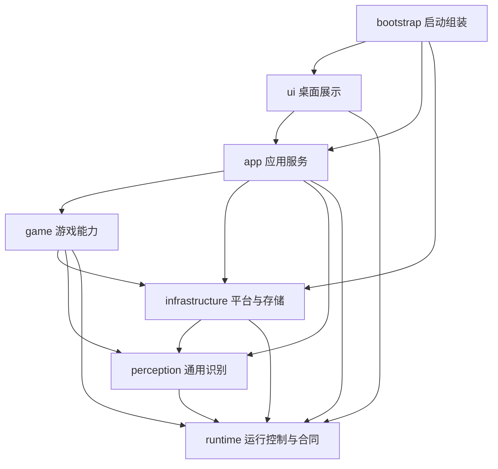
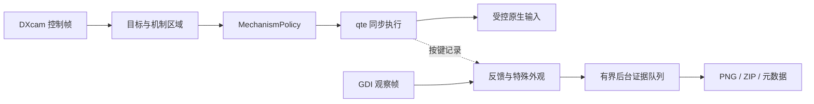

# 项目架构与扩展边界

[文档目录](../README.md) · [目录布局](repository-layout.md) · [开发指南](../development/guide.md) · [开发规范](../development/standards.md)

本文按当前源码描述已实现架构，再列后续目标；2026-09-14 的实现缺陷与维护热点见[代码审查](../development/code-review-2026-09-14.md)。首轮方案、旧模块名及迁移过程保存在[架构阶段档案](../history/architecture-2026-09-08.md)。

## 划分依据

项目是单进程的 Windows 桌面应用，按功能归属、修改原因和资源所有权划分模块。抛竿、等待、QTE、结算是任务执行步骤，留在钓鱼能力内部，不作为仓库顶层分层。

`bd2_fishing/` 直接位于仓库根目录。统一包名服务于内部导入、工具调用和打包，不意味着要作为第三方库发布；构建显式收集应用包。公共图像与文字处理放 perception，取消和设备合同放 runtime，Windows 与持久化实现放 infrastructure，不建立万能 utils/common 模块。

## 当前依赖

以下箭头表示 **Python 导入方向**，不是游戏操作顺序。类或子包职责见[开发指南](../development/guide.md)。



| 部分 | 拥有的职责 | 重要边界 |
| --- | --- | --- |
| ui | 任务、图鉴、目标、鱼获、设置草稿、运行记录与更新窗口 | 只通过 app 调用任务与设备服务，Tk 控件只在主线程更新 |
| app | 用户请求、单任务生命周期、配置/设备组装、跨功能恢复、更新用例 | 不让页面直接操作钓鱼策略或原生驱动 |
| game | 岛屿、导航、背包、钓鱼的识别、规则与动作 | 动作/观察器可调用现有适配器；纯机制、反馈规则与目录不依赖设备 |
| perception | 通用图像与文字处理、OCR 数据和读取合同 | 不导入游戏或具体平台引擎 |
| runtime | 取消、输入互斥、轮次上下文、几何、最小设备合同 | 不反向导入 app、game、ui、infrastructure |
| infrastructure | DXcam/GDI、窗口/输入、电源、OCR、配置、日志、证据与更新事务 | 不拥有 QTE 策略或岛屿业务判断 |

规则由 `scripts/checks/check_architecture.py` 自动检查。当前 game 执行代码仍使用部分具体适配器，不能把上图改成“所有设备均已注入”的理想结构；现有截图工厂和合同在需要模拟、录制或替换时使用。

## 钓鱼与机制链路

启动与轮次衔接使用[统一页面识别](scene-recognition.md)，与逐帧 QTE 控制分开。页面能力和未覆盖入口以该文档为准。

```text
game/fishing/
├── scene.py                      统一只读页面判断：待机、面板、QTE、未知／无图
├── startup.py                    启动观察、接续分支与独立启动证据
├── actions.py / cast_feedback.py  抛竿、恢复动作与提示判断
├── qte.py                        控制循环、地点策略与同步输入
├── mechanics/
│   ├── policy.py                 唯一动作意图及黄蓝目标策略
│   ├── regions.py                同帧红紫绿区域与泡泡几何
│   ├── blue_target.py            蓝区可靠内部边界与小孔修补
│   ├── green_control.py          有界按下、持有、释放状态
│   ├── bubbles.py / bubble_targets.py  单球许可与多球身份去重
│   ├── bubble_memory.py          已确认泡泡消失后的局部残影避让
│   ├── yellow_geometry.py / yellow_aim.py  黄条实体/短期边界与中心偏好
│   ├── shells.py                 贝壳模板定位与局部禁区
│   ├── blockers.py               六钓场共用多墙实体识别
│   └── lifecycle.py              观察侧多外观实例时间线
├── pointer.py / trigger_rules.py  真光标观察与同次入区去重
├── scene_signals.py               独立观察帧中的特殊外观线索
├── scene_evidence.py              场景事件和前后图
├── feedback*.py / recognition.py  反馈识别与按键归属
├── settlement*.py / page.py       鱼获与待机页面确认
├── recovery.py                   失败轮次恢复、按类型关闭连续结算弹窗
├── panels.py / templates.py       结算弹窗身份与共用字形匹配
├── dialogs.py / notices.py        上层提示身份与 150302 完整错误码核对
├── presence.py                   已开始 QTE 的短暂计时颜色容错
├── tracing.py / hook_diagnostics.py  轮次统计与上钩取证
└── assets/                       运行时识别模板
```

两套地点策略共用 `BaseQTEStrategy.play_qte`。控制帧提取目标和机制区域后交给 `MechanismPolicy`，返回 normal、wait、press、down 或 up；只有执行层发送输入，处理器之间不各自按键。

普通目标黄色优先，无有效黄区时检查蓝区安全边界并连续确认。绿色按下/持有/释放独占输入；未确认起按端但有可靠范围时，范围和边距外的普通目标及不相交泡泡仍可独立判断。红紫、贝壳和泡泡残影构成局部约束。时间从调用方传入，纯状态规则不截图、不等待、不写盘。

控制与观察是两条关联但不同的链：



独立观察帧不代表控制决策的同一时刻，旧观察不能授权当前输入。外观连续出现、消失或中断不等于技能身份确认；按键与消失时间接近也不证明解除成功。

**完整技能处理链尚未实现。** 绿色实际起按端未确认，识别不自动授权长按；泡泡许可只记录尝试；冰冻已有后台计数候选但未接解除输入，墙体检测、可达范围与遮挡约束已在六钓场共用，完整碰撞与解除仍待实测。抵抗提示、组合技能身份及解除因果需继续补齐，见[机制链审计](../development/mechanism-chain-audit.md)与[验证计划](../development/validation-plan.md)。

## 图鉴、鱼获与目标

`ui/workspace.py` 统一导航和公共启停，各页面保留自身筛选与滚动状态。`app/fish_catalogue.py` 读取包内 84 种鱼与图片；`app/fishing_collection.py` 协调确认结果、图片与个人记录，`infrastructure/fishing_journal.py` 只负责持久化事务。

结算观察器先确认捕获，再提取尺寸标签、等级、边框颜色和新纪录，并通过回调保存；鱼获追加与当前任务条件删除在同一 SQLite 事务完成。旧轮次与重复观察不能抵扣新任务，写入失败抛 RunStopped，保留奖励页面。未知鱼种保留原图和记录，不误完成目标。

`app/target_routing.py` 在抛竿前读取当前地点和两帧游戏时钟，优先当前岛屿可完成要求，再复用导航跨岛；缺少昼夜证据则可取消地等待。MAX／MIN 是独立待办，全部完成后停止，不转为自由模式。调度不修改逐帧 QTE 输入时序。

## 生命周期与低时延

app 管理一个会话的工作线程、聚焦、COM、电源、截图和 OCR；runtime 提供取消与输入锁。停止、异常和窗口保护触发时释放输入与资源，旧任务未退出不启动第二个任务。`RunStopped(BaseException)` 的设计用于穿过普通业务异常捕获。

QTE 在原控制线程中采样、判断并同步输入，不增加待执行按键队列。PNG/ZIP 编码与文件日志在有界后台处理；证据积压不能通过同步写盘回退到控制路径。反馈、场景和 OCR 观察仍有资源与锁开销，必须单独测量。

循环节流、按住、松开后等待、页面确认是不同参数，不能统一缩短。基础等待校准不包括截图、驱动或游戏响应；目前没有完整游戏端到端时延基线，指标与测量方法见[QTE 时延设计](qte-performance.md)。

## 更新与数据

ui/updates 通过 app/updates 调用版本检查、本地包导入与重启交接；infrastructure/updates 执行下载、清单校验、文件备份替换和恢复。独立助手等待主程序退出，更新成功后重启至待机。

`manifest.json` 只管理程序文件，配置、校准、个人鱼获数据库、日志与截图独立保存。启动初始化和便携版待机清理不进入 QTE 循环。源码 `.local/`、便携目录、构建输出各有用途，见[目录布局](repository-layout.md)和[更新设计](portable-update.md)。

## 后续扩展：尚未实施

| 方向 | 归属与要求 |
| --- | --- |
| 从开始页进入钓鱼 | navigation 补已确认页面、转换与到达验证；app 组合准备任务，未知页面不盲点 |
| 天空岛专属机制及更多岛屿 | 六钓场目录已存在；继续补稳定身份、资料与各岛机制覆盖，不以目录登记代表实测通过 |
| 玩法信息读取 | 所属功能提供值、时间、来源帧及未知/过期状态，app 汇总；读取失败不填成 0 |
| 更多机制及组合 | fishing/mechanics 扩充识别、约束与状态，由 policy 统一输入权限；配真实正负例及连续时序证据 |
| 其他岛屿玩法 | game 新增对应功能，app 增加任务入口；复用运行与导航能力，不复制整个钓鱼包 |
| 可替换设备与回放 | 在真实替换或测试需求处提取小合同，不给每个函数增加接口或转发层 |

地点资料收录、页面可识别、可以导航、信息可读、机制已验证是不同能力，不能用一个 supported 标志混在一起。每次扩展单独说明实现与实测范围，目录迁移不夹带未经验证的阈值和输入时序修改。
