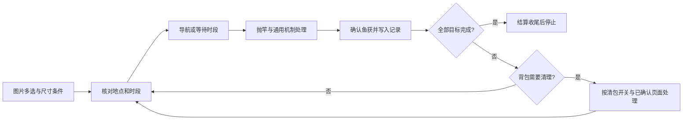

# 鱼获记录与图片选鱼方案

[资料库](../reference/fishing/README.md) · [84 种参考图鉴](../reference/fishing/fish-catalogue.md)

2026-09-14 用户已确认：记录全部鱼种与最大／最小成就，图片多选后跨岛并等待昼夜，直到全部要求完成；首次、彩色、最大、最小分别筛选，保留完整带图历史。自动锁鱼以后再做。

## 当前实现（0.4.0）

已按[第四版主界面交互](ui-workspace-proposal.md)接入原生桌面窗口。图鉴以图标切换网格和列表，列表详情行内展开；先选尺寸要求，再点击鱼卡多选，可逐鱼修改条件。目标按当前任务新捕获的确定鱼种及标签完成，MAX／MIN 独立清除，全部完成后停止。记录和目标使用 SQLite 事务，图像随个人记录保存。

跨岛调度读取当前地点及游戏时钟，缺少时段证据则等待；自由钓鱼也保存记录。已通过离线回归，EXE 交付状态见[当前状态](../development/status.md)。成功截图已确认红色 Maximum Size、黄色 New Record、绿色一级和蓝色二级；MIN 和彩色三级成功页仍待自然取证，详见[复核](../development/catch-markers-2026-09-14.md)。

下面保留业务方案和验收示例；交互以第四版为准，自动锁鱼尚未实现。

## 建议的界面行为

主窗口“图鉴”页点击“选择目标”，在同一页面选择鱼图。上方按岛屿、昼夜、稀有度、名称筛选；名称搜索同时接受简体、繁体和已登记译名。每张卡片显示鱼身缩略图、简体名、稀有度及昼／夜图标，点击卡片多选。已选状态和尺寸条件直接显示在卡片与右侧目标清单中。

每条鱼的条件为“任意尺寸”“最大尺寸”“最小尺寸”；同时选择最大和最小生成两项独立待办，不要求一条鱼同时 Max 和 Min。任务开始前显示岛屿、可钓时段、待办条件和清包选项，不把来源 ID、OCR 置信度、机制内部 ID 塞进用户流程。

```text
选择目标鱼       岛屿 ▾   时段 ▾   稀有度 ▾   搜索名称

[鱼图] 内萨       [鱼图] 龙鱼       [鱼图] 巨骨舌鱼
传说 · 白天      稀有 · 白天       传说 · 夜晚
✓ 最大尺寸      未选择            ✓ 任意尺寸

目标清单：内萨／最大尺寸；巨骨舌鱼／任意尺寸
开始后：先确认游戏时段与地点，再执行可钓目标
                           [取消] [采用这组目标]
```

建议使用独立选择面板，保持当前主窗口的开始／停止与日志布局。面板只编辑待机任务；运行中查看进度，不静默改动正在执行的目标。繁体图鉴截图不能直接当按钮图，后续裁鱼身并用简体文字单独绘制；缺图显示可识别占位，不能借图顺序猜鱼名。

## 目标完成规则

| 选择 | 何时完成 |
| --- | --- |
| 一条鱼、任意尺寸 | 本任务首次确认捕获该鱼 |
| 多条鱼 | 清单每条都至少确认捕获一次；捕到其中一条只完成对应项 |
| 某条鱼最大或最小 | 捕获该鱼且对应 Max／Min 状态确认；普通尺寸不能完成 |
| 同鱼最大和最小 | 分别完成 Max 和 Min 两项；不能将“最大或最小任一”误作“两项都完成” |

基础版本每个目标要求 1 次，不增加自定义数量。历史图鉴已捕获不自动完成新任务；任务开始前可显示历史成就，当前停止条件只看本次任务的确认事件。以后若增加“只补未完成成就”模式，应作为显式模式，不能悄悄改变语义。

目标全完成后，完成当前结算的记录和必要收尾，停止继续抛竿。鱼获识别不确定时保存原图，显示待确认，不能因为猜到目标鱼就停止成功。用户主动停止、失焦、窗口变化、异常保护随时优先于目标任务。

## 三类数据独立保存

| 数据 | 内容和用途 |
| --- | --- |
| 鱼种图鉴 | 稳定 `fish_id`、简体名称与别名、岛屿、昼夜、稀有度、图片、参考尺寸、可能机制及来源；随资料版本更新 |
| 鱼获事件 | `catch_id`、任务／轮次、时间、鱼种候选或确认、实际尺寸、Max／Min／未知、结算证据、确认方式；每次实际捕获追加一条 |
| 目标进度 | 本任务目标清单、已匹配事件、待完成条件、暂停原因；从鱼获事件计算，可重建 |

鱼获记录覆盖全部鱼种，不只记录彩色；首页按用户确认优先展示首次捕获、彩色鱼、Max／Min，并提供完整历史入口。首次捕获按用户持久历史判定，任务目标完成仍按本次任务判定。同一次捕获命中多个展示条件时只展示一条记录并附多个标记。以确认结算作为捕获依据，QTE 结束、上钩、HIT 或距离数值均不能代替鱼获。多帧同一个结算只生成一个事件，避免一次鱼获重复计数。

Max／Min 优先采用结算或可靠图鉴中的游戏标记。某次刷新个人最大／最小纪录，不一定达到了物种极限；不能仅凭“比此前大”记成 Max。参考尺寸 OCR 目前未逐项核实，不能把范围直接变成任务判定常量。未知尺寸状态用 `unknown`，不能当作否定或自动满足。

记录应放在用户数据目录，避免随诊断图片轮转丢失。事件与证据关联，关键证据应随记录保留；原始作者图鉴上的个人成绩不得导入。记录先提交成功再允许后续清包；记录写入失败时保留结算并停止相关自动流程，避免出售后丢失唯一确认依据。

## 选鱼到地点及跨时段调度

从 `fish_id` 取得现有 `FishingLocation`，通过已有码头／选岛／启航流程进入，不另写固定坐标捷径。到岛后仍确认地点和游戏时钟。无许可证时提示原因并保持待机，不自动购买。目标鱼只在夜晚出现而当前白天时，显示“等待夜晚”；不能在错误时段无限抛竿却显示正在完成目标。

首版支持多岛多选与昼夜等待，已由用户确认。调度建议按“当前岛可钓未完成目标→其他可钓目标→等待下一时段”推进，减少反复切岛；有其他岛当前可钓的目标时，不因当前岛剩余目标暂不可钓而一直等待。调度在鱼获结算后执行，不能 QTE 中途切岛。不修改系统时钟。后台估算昼夜仅决定下次检查时刻，实际可钓时段由游戏状态确认。跨岛／等待期间停止按钮仍有效。



## 自动清包与以后锁鱼

已有 `auto_clear_enabled` 继续有效，关闭时满包停止，不因目标未完成绕过。自动清包仍有固定坐标、页面复核和手动工具保护问题；接入目标任务前应先解决[清包审查项](../development/code-review-2026-09-14.md)。目标模式不能放大现有未确认出售风险。

“捕获记录保留”与“背包鱼获保留”是不同需求。当前用户将锁鱼放在后期，因此本方案先保证记账和完成进度；不能宣称未实现锁定的鱼永远不会被自动出售。多目标任务中已完成的鱼，记录仍在，但物品本身是否保留需要未来保护机制。

以后锁鱼必须基于结算与背包中同一实例的关联，点击后确认锁标记，出售页再次排除锁定项。不能只按鱼名锁第一条，也不能把“发过锁定点击”当作成功。本轮不实现锁定流程。

## 分阶段实施建议与验收

1. 先确认简体结算与图鉴的真实截图，完善译名、鱼身图片和 Max／Min 标记。接入所有鱼种的只读捕获记录，验证重复结算、未知文字、异常退出和落盘恢复。
2. 实现图片多选面板和目标任务，按上述全清单及尺寸条件停止。首版必须支持跨岛多选与昼夜等待；同岛场景仅作为内部联调步骤，不能把交付范围缩减为仅同岛。真实捕获前不能用纯模拟测试宣布成功。
3. 修复清包页面确认后，将目标进度、清包和地点／昼夜调度衔接。首版一并验证许可缺失、错误地点、时段变化、满包、用户停止及识别未知；不把跨岛交付推迟到以后。
4. 最后讨论锁鱼与成就缺项补全。上线前确认当前用户是否希望多目标已完成鱼保留在背包；未完成锁定验收不宣传防误卖。

2026-09-14 补充确认：

| 项目 | 已确认需求 | 验收示例 |
| --- | --- | --- |
| 首版目标模式范围 | 跨岛多选与昼夜等待，直到全部目标完成 | 岛 A 白天目标完成后，转到当前可钓的岛 B 目标；只剩夜间目标时等待夜间。全部完成前不能显示成功停止；用户停止与窗口保护仍优先 |
| 鱼获主视图 | 优先展示首次捕获、彩色鱼、Max／Min 成就，能展开完整历史 | 重复普通尺寸鱼不挤占重点列表，但完整历史中可查；首次彩色 Max 鱼只记一条鱼获，展示三个标记 |

全部确认鱼获都保留，筛选不删除历史。以上选择及多选、全目标完成、最大／最小条件和繁简处理不再重复询问。布局以已认可的第四版主窗口为准；后续授权已推进到 0.4.0 实现与 EXE 交付，不再保留早期“先讨论”的实施限制。
