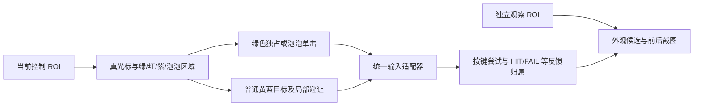
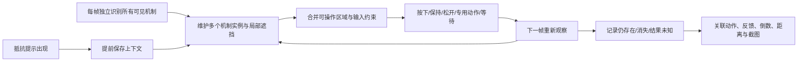

# 特殊机制处理链审计（2026-09-09）

[机制资料](../reference/fishing-mechanics.md) · [处理设计](../design/special-mechanism-handling.md) · [开发状态](status.md)

后续各项的样本、实测入口与完成判据统一纳入[待验证问题与推进计划](validation-plan.md)，
没有触发的机制保持未覆盖，不以普通钓鱼成功代替。

## 结论与检查范围

当前源码具备逐帧局部识别、部分输入仲裁和独立取证，但没有从鱼抵抗提示到各项技能结束的统一处理链。
不能将攻略第 3、7–12 项整体标为已解决；第 9/11 项具有可用基础策略，第 10 项已接入尝试，
第 3/12 项主要是局部避让，第 7 项缺少冰冻识别与专用三连击，第 8 项只有有限挡板处理。
第 13 项无需主动解除，但其指针外观与速度变化仍会影响识别和命中。

本轮检查源码与已打包版本对应的控制逻辑，不操作游戏、不修改输入时序、不重新构建 EXE。
通过浏览器读取[攻略主楼](https://forum.gamer.com.tw/Co.php?bPage=3&bsn=76207&sn=49155&subbsn=3)，
查看图 2-1，并逐张查看图 2-2 的十二张配图。此前仅读文字的限制已在本次图片审计范围内解除。
图片来自作者提供的静态示例，不能用于证明连续时间、输入因果、技能解除或本机实测成功。

原图与 SHA-256、来源 URL、人工裁剪坐标、源码识别结果保存在本机
`.local/maintenance/guide-mechanism-audit-20260909/replay.json` 和 `originals/`。
全屏原图按正式默认 ROI 裁剪；第 7/8/12 张原本就是局部图，显式标注裁剪，不能套整屏百分比。
第三方原图留在本地维护目录，不作为新运行模板装入 EXE。

## 逐项覆盖（编号按攻略原始列表）

| 编号与机制 | 当前代码行为 | 尚缺的验收条件 |
| --- | --- | --- |
| 1 锁普通命中区 | 按颜色提取黄蓝目标；攻略锁蓝图的灰区未进入蓝掩膜 | 没有独立锁定/解除状态，需核对灰色与边缘、特效叠加 |
| 2 龙卷 | 读取当帧可见真光标，没有专用解除动作 | 带旋风外观的指针可能漏识别；固定采样/输入时延在加速后可能错过窗口 |
| 3 咬人 | 红种子与浅粉区域联合定位，局部避让，不自动三连击 | 不是完整牙齿分类器；缺少倒数、期间目标命中、扣时与结束关联 |
| 4 贝壳 | 深渊有有限挡板筛选，其他颜色障碍可能偶然覆盖贝壳 | 攻略贝壳图未被现有障碍/挡板逻辑捕获，不能视为支持 |
| 5 喷墨 | 没有可靠光标或目标时等待 | 没有墨汁遮挡层，部分可见像素仍可能误形成可点击目标 |
| 6 隐形指针 | 拒绝只有暗候选或亮度歧义的输入 | 没有专用透明指针识别；攻略明确无感叹号，不能要求触发提示才检测 |
| 7 冰冻 | 已取消旧“红像素即破冰”的无依据输入 | 没有冰晶分类器、独立三连击动作及解除确认；数字颜色不能代替冰冻身份 |
| 8 反弹壁 | 深渊策略找单个挡板矩形并限制可用范围；观察线程记录方向反转 | 两套策略未统一，多墙集合、碰撞与墙消失关联没有完成；方向反转本身不证明碰墙 |
| 9 分身指针 | 共享窄竖线候选与亮度排序；攻略图和本机清晰样本能选中真光标 | 遮挡/交叠/特效下可能不识别；没有独立生命周期与身份跟踪 |
| 10 泡泡球 | 独立圆环识别、一次输入许可、普通目标排除球体描边 | 球内光标遮挡仍可能无解；没有确认击破、自然到期、距离惩罚的结果关联 |
| 11 黄区消失 | 两套策略连续有蓝无有效黄区后回退蓝区，光标重合才输入 | 未显式记录该技能开始/黄区恢复；实际绿条仍应使用长按模式 |
| 12 毒海浪 | 紫色局部避让，其余有效目标继续使用 | 没有主动消除或结束确认；主楼与后续回复的扣时差异仍需实测 |
| 13 麻痹指针 | 普通策略持续观察当帧位置；观察线程记录可见位移 | 没有解除动作是合理的，但黄色电光包裹的指针可能不能通过白亮线定位 |

另有绿色维持区输入状态机，真实图的深色起按端仍未可靠标注；这与第 11 项的普通蓝条单击不同。

后续用户反馈补充：第 11 项仍存在“已识别并按键，但未命中蓝区”的现象，不能因回退分支
已实现就标为命中问题已解决。蓝色掩膜膨胀与光标容差叠加是源码中的明确排查点，
具体失败因果待关联原图与时序；见 [BLUE-01](error-triage.md#blue-01仅蓝区时已识别并触发但实际未命中2026-09-09-用户反馈)。

2026-09-10 更新：BLUE-01 已取消蓝区膨胀与按键外扩容差，真实边缘外按键图回归通过，
蓝区动作保留原始及安全内部区间元数据。该改动修复输入边界，不表示本审计中的其他机制
或抵抗提示到机制结束的完整状态链已实现，游戏时延与实际命中率仍需后续验证。

## 配图回放的关键证据

编号是图册中的图片顺序，不是技能编号。以下是静态定位结果，不是对完整策略的游戏输入回放。

| 图片 | 可见现象 | 当前识别结果与含义 |
| --- | --- | --- |
| 01 | 灰色普通区、黄色弱点、抵抗提示 | 蓝像素为 0；支持灰区不能作蓝区处理 |
| 02 | 牙齿倒数与旋风光标同时出现 | 识别到局部红区，但真光标为空；已有叠加场景不能只标一个技能 |
| 03 | 牙齿、黄蓝目标、FAIL、抵抗提示 | 有局部红区；FAIL 与牙齿同时出现不证明该 FAIL 是牙齿惩罚 |
| 04 | 三个贝壳覆盖不同位置 | 通用 blocked 为 0/494 列，深渊 `_blocker_rect` 也为空；残余黄蓝像素不等于可操作区域 |
| 05 | 墨汁遮挡，黄区仍有部分可见 | 未生成遮挡区间；不能仅因有黄像素就认定其完整可用 |
| 06 | 竖直冰晶、数字 3、冰霜边框 | 通用指针定位返回 QTE x=355，位置落在冰晶；数字贡献红区。Frost 的额外红区检查在此处会阻止普通输入，不能据此推断两套策略都能正确处理冰冻 |
| 07 | 宽白墙与窄亮光标同时可见 | 通用指针定位选中窄亮线；该函数不负责识别墙，也不能证明碰撞后的反向已处理 |
| 08 | 一亮三暗光标 | 选择 QTE x=507，符合画面最亮光标；支持现有亮度排序规则 |
| 09 | 泡泡覆盖指针附近 | 定位泡泡区间 [318,371)，没有可靠真光标；识别出球体不等于能够击破 |
| 10 | 只有蓝区、真光标在蓝区右边 | 黄像素为 0，真光标可定位；应等重合，不因没有黄色立即按键 |
| 11 | 紫色路障、蓝黄目标、抵抗提示 | 定位局部紫区；不提供单击消除的因果证据 |
| 12 | 两个贝壳、黄色电光包裹指针 | 指针为空，只有 13/640 列被红紫掩膜阻挡；减速无需解除，不等于该外观无需识别适配 |

所有全屏图与局部图的比例不同，不横向比较像素数。第 06 张的数字 3 是待破冰计数线索，
不能和牙齿/泡泡内部数字或整轮倒计时共用一个未经分类的计数器。

## 当前代码链路

2026-09-10 架构更新：纯识别与规则已集中到 `game/fishing/mechanics/`。
`qte.py::_mechanism_step` 调用 `mechanics/policy.py::MechanismPolicy` 仲裁专用动作，
两套地点策略共用控制循环和 `TargetPolicy` 的黄蓝确认/去重。挡板算法移入
`mechanics/blockers.py`，仍然是既有单挡板行为；`bubbles.py` 位于 mechanics 子包内。
该拆分建立控制状态归属，不代表下文的感叹号、多机制实例与处理结果链已经补齐。

- `qte.py::_mechanism_step` 每帧运行，已有多区域并存和最多一个动作的部分仲裁，
  并非只能选一个颜色；绿色优先于泡泡、普通命中。缺口是分类覆盖与统一状态，不应把现有部分全部推倒。
- `scene_signals.py::SceneSignals.inspect` 返回多条外观候选，但没有抵抗感叹号检测；
  控制小 ROI 本身也不包含进度条上方完整提示，观察 ROI 才可能覆盖它。
- `scene_evidence.py::SceneRecorder.observe` 按线索保存事件和前后图；可以同帧多标签，
  2026-09-10 已加入 `mechanics/lifecycle.py` 的候选/活动/连续未见/未知状态。
  同类多个可区分区域分别编号，交叠歧义不继承旧身份；这仍是外观实例，不是已分类的技能实例。
  按键仅按观察时间区间列为上下文，没有把图示消失判定为动作成功。
- `bubbles.py::BubbleController` 的 consumed 表示该生命周期已经获准尝试一次，
  不表示泡泡已解除；按键失败、普通反馈与游戏机制消失必须分别记录。
- `feedback.py` 关联的是按键与 HIT/CRITICAL/MISS/FAIL/unknown；`settlement.py` 确认整鱼结算。
  二者都不能代替机制解除确认。

## 应补齐的处理链

2026-09-10 推进记录：已修复新候选在上一事件后 0.5 秒内被抑制的问题；同类重复事件
仍限频，既有图片、分段与队列上限保留。外观实例的两帧确认、两帧未见、断档、几何变化、
QTE 不可观察与收尾均有离线回归；非递增时间戳不能重复确认。每轮最多 256 个实例，
超过上限计数；`result` 始终 unknown。下一步仍需有样本的技能分类、控制动作及解除确认，
不能将此记录能力标为第 3/7/8/10/12 项的完整处理。详见[质量与取证改进](cases/2026-09-10-quality-and-scenes.md)。

感叹号只是鱼抵抗提示，不能确定具体技能，更不能作为检测开关。没有提示、漏采提示或多个技能叠加时，
每帧识别仍须运行。触发事件与各机制实例为一对多的可能关联，不根据近邻时间硬绑因果。

状态模型需要区分候选、确认出现、活动中、动作已尝试、消失已观察、结果未知；
只有足够游戏反馈才记处理成功。图示消失也可能是到期、遮挡、截图断档或 QTE 结束。
每个实例保留轮次、机制类型、独立实例 ID、区间、置信度、时间戳、关联动作和证据编号。
同类多个贝壳/墙也必须分别跟踪；不能给整帧放一个 `special_mode` 枚举。

输入按停止/释放保护、已持有动作、新的专用动作与普通目标综合仲裁。
冰冻只有被可靠分类后才可获得有界三击许可，每次输入响应取消，并在后续帧确认计数/冰晶变化；
不能恢复红色阈值连按，也不能由感叹号直接派发三击。绿区、泡泡与其他障碍叠加时应明确谁独占输入。

延迟方面：快速控制继续复用同一小 ROI，只计算当帧几何与状态；提示识别、OCR 与证据整理在观察侧运行。
观察侧的滞后候选不能直接授权当前输入。需要扩大快速 ROI 才能分类的冰晶/贝壳，须先测新增成本与跨窗口比例。
反向、加速、减速后不能继续使用过期速度外推；离线处理耗时与游戏端到端时延分开验收。

优先实现：先修贝壳/冰晶与光标、目标的分离，补抵抗提示及多实例记录；
再接冰冻专用动作、反弹壁统一约束及各机制结果确认。已有分身、无黄蓝条、泡泡策略保留，
以这十二张第三方图加本机正负例验证分类，再用后续真实连续帧验证生命周期和游戏效果。
