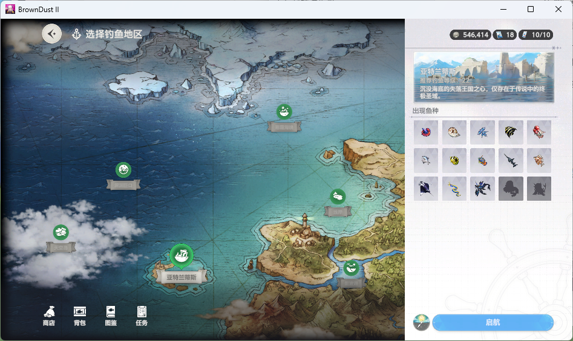
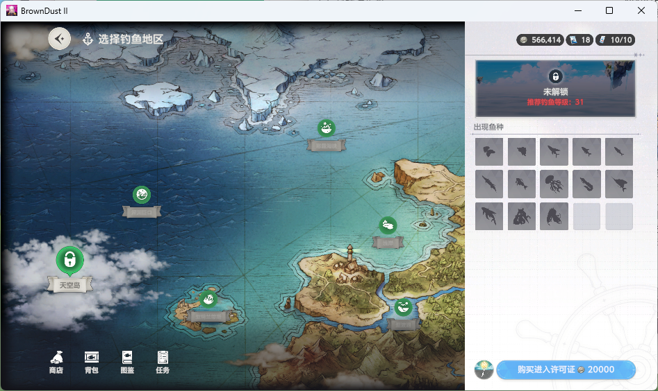
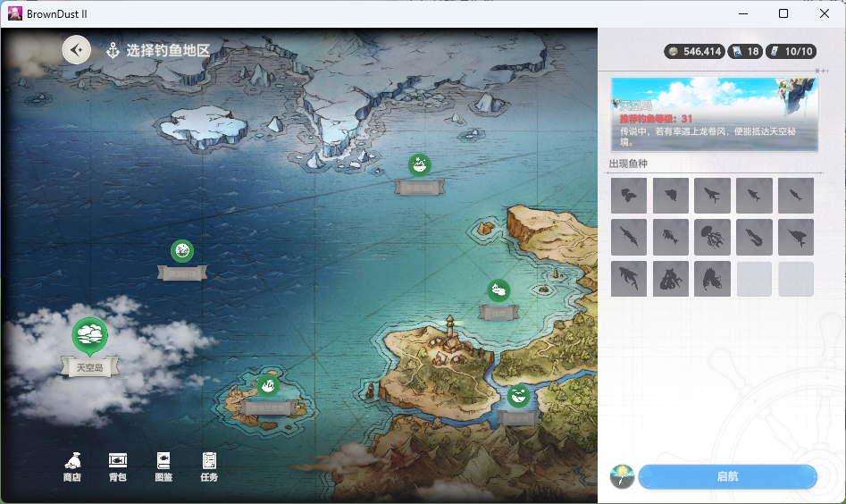

# Fishing Voyage：入口、选岛与许可证

[文档目录](../README.md) · [封面参考](fishing-voyage.md) · [当前页面识别](../design/scene-recognition.md) · [原图与校验清单](../../tests/fixtures/voyage_pages/README.md)

## 来源与实现边界

2026-09-11 用户先后提供七张游戏截图并解释操作关系和鱼种解锁标记。最初归档后，已按用户要求补充源码识别与导航并进行实测；已纳入 0.3.0 本机便携包，未自动购买许可证；打包验收与边界见[版本记录](../development/cases/2026-09-11-release-0.3.0.md)。下文区分样本事实、当前实现及未验证范围。

## 页面与转换

| 图 | 页面 / 状态 | 可见依据与用户确认 |
| --- | --- | --- |
| 1 | 加载过场 | Fishing Voyage 封面，右下角进度 0%；不能仅凭封面判断加载完成 |
| 2 | 码头 | “码头”“我的信息”，右下角“开始钓鱼”；用户确认点击后进入地图选择 |
| 3 | 地图，选中烟波湖 | “选择钓鱼地区”，右侧烟波湖、推荐钓鱼等级 1；选中圆标放大并有波纹，下方“启航” |
| 4 | 拖动后的地图，选中浅岸 | 右侧浅岸、推荐钓鱼等级 7；地图中岛屿位置变化，左侧天空岛显示锁 |
| 5 | 地图，天空岛未购买许可证 | 右侧“未解锁”、锁图标、红色推荐钓鱼等级 31；“购买进入许可证 20000” |
| 6 | 地图，天空岛已购买许可证 | 右侧变为天空岛名称与介绍，锁图标变为岛屿图标，按钮变为“启航”；推荐等级 31 仍红色 |
| 7 | 地图，选中亚特兰蒂斯 | 推荐钓鱼等级 22；“出现鱼种”中混合彩色图标与黑色剪影，用户确认分别表示鱼种已解锁与未解锁 |

用户确认的主流程：码头 → 点击“开始钓鱼” → 地图选择 → 选择岛屿 → 点击“启航” → 进入岛屿钓鱼。加载图属于过场，但这组六张静态图不足以确认它在每一种导航中的出现位置、耗时和完成信号。

进入岛屿后，已有钓鱼场景识别负责待抛竿 → 等待咬钩 → QTE → 结算/升级 → 下一轮。地图上的“启航”和钓鱼场景的“抛竿”是不同动作。

## 岛屿内的换图与返回

用户随后补充两张[导航控件与返回确认原图](../../tests/fixtures/voyage_pages/controls/README.md)，确认以下两条路径：

| 控件 | 页面转换 | 处理边界 |
| --- | --- | --- |
| 左上角“更改” | 当前岛屿 → 选择钓鱼地区 | 用户确认点击直接进入地图，用于切换钓场；不需要经过返回码头确认 |
| 右上角船锚 | 当前岛屿 → “返回码头”确认框 → 点击“确认” → 码头开始页面 | 离开当前船只；属于退出航海流程，不能作为换图按钮 |

两类确认框分别处理：

- **返回码头**：询问是否离开当前船只，含取消和确认。`dialogs.py` 优先识别为 `blocked_dialog / return_to_dock`，导航停止并记录，不自动点击船锚或确认返回，也不交给鱼获结算关闭。
- **前往钓鱼地区**：启航后可能出现，正文含目的地及“当前使用的钓鱼消耗品将全部失效”。用户于 2026-09-11 明确确认这是普通换岛步骤，可直接确认。导航连续两次读到弹窗后，核对目的地与目标一致且有对应钓鱼策略，点击一次确认，再观察到达。目的地不明或不符时保留现场；不重复确认。`[navigation] confirm_island_change = false` 可关闭自动确认，默认 true。效果失效来自此弹窗本身的证据，不推断物品返还。

新导航支持显式 `change_from_island` 模式：先确认待抛竿页面及本帧“更改”“使用时间”文字，再进入地图。当前岛名漏读时保留未知，不妨碍打开地图；目标名仍须在地图和确认框核对。源码测试工具 `--navigation-only` 使用此模式，到达即停止；日常直接在钓场启动仍沿用原流程。`game/islands/travel.py` 已迁为往返策略：烟波湖经浅岸中转，其余已支持岛屿经烟波湖中转；每段调用同一导航，确认返回后才继续钓鱼。固定坐标选岛和盲点确认已移除。

## 许可证和推荐等级分别判断

图 2 的玩家等级为 26；天空岛推荐等级为 31，用户说明红字表示当前等级未达到推荐值。图 5、6 的红字没有随许可证购买消失，因此不能把等级提示当作许可证状态。

图 5 显示金币 566,414，图 6 为 546,414，与许可证价格 20,000 一致。用户确认该购买不可逆，当前无法回到购买前状态。两张原图分别保存，后续用离线样本覆盖购买前的识别，不能要求用户重复购买来补测试。

图 6 已显示“启航”，但没有提供点击之后的画面。因此能确认按钮已变化，尚不能确认低于推荐等级时实际进入是否还会有提示或限制。

绿色圆标用于地图上的岛屿入口，其中锁定岛屿也有绿色圆标。需要分别记录：

- 是否被选中：放大、波纹与右侧详情共同确认。
- 许可证状态：锁图标、“未解锁”、购买按钮或启航按钮共同确认。
- 推荐等级状态：玩家等级、推荐数值和红色提示，不替代许可证判断。
- 当前动作含义：启航、购买许可证或未知；不能仅按按钮坐标判定。

鱼种剪影不用于判断岛屿进入权限：用户补充确认它表示鱼种未解锁。图 6 购买许可证后仍有剪影，不能据此推断许可证未生效。

## 鱼种解锁状态

用户确认图 7 的黑色剪影表示未解锁的鱼，彩色图标表示已经解锁的鱼。此规则描述的是右侧“出现鱼种”网格，不用于判断岛屿是否解锁。

图 7 人工核对共有 3 行 × 5 列、15 个鱼种格位：第 3 行第 4、5 列为未解锁剪影，其余 13 格为已解锁图标。这里的数量仅对应当前亚特兰蒂斯页面，不能固定为所有岛屿的鱼种数量。鱼名、解锁条件、是否首次捕获即解锁，均不能仅凭此图确认。

后续读取时，每个格位记录已解锁、未解锁或未知；空白格与未解锁剪影分开。不能只用“颜色暗”判定未解锁，图 7 中已解锁鱼也有深色外观，应结合图标细节、剪影外观与格位背景，无法可靠区分时保留未知。鱼种信息读取在地图阶段进行，不加入 QTE 热路径。

## 识别和导航设计

`game/navigation/voyage_reading.py` 实现页面、圆标、鱼种和 OCR 读数，`voyage.py` 实现有界动作与证据，`app/session.py` 在钓鱼任务前调用。当前实现如下；实际覆盖范围见文末。

1. 将页面分类为加载、码头、选岛和钓鱼场景；地图内的选中岛屿、许可证与等级属于页面读数，避免为每种组合创建独立页面类型。看不到的字段保留未知，不默认未购买或已解锁。
2. 码头通过页面标题、信息面板和“开始钓鱼”联合确认；地图通过页面标题、右侧详情和底部动作联合确认。角色、船型、海面昼夜只作为背景，不作为主识别条件。
3. 岛屿先检测可见圆标及名称，点击后核对右侧详情。拖动后重新定位，不能沿用旧坐标；搜索有次数和时间上限，未找到目标时保存证据，不点击附近岛屿代替。
4. 启航前重新读取选中岛屿和按钮文字。购买按钮与启航共用位置，默认导航不执行购买；识别到购买要求时展示岛屿、价格和状态，等待用户处理。用户本次已完成的购买不构成后续自动购买授权。
5. 点击开始钓鱼或启航后，观察目标页面与加载状态；设置有界等待和取消检查。未知状态记录原图及识别读数，避免在过场期间重复点击。只有确认进入钓鱼场景后，才交给现有启动接续逻辑。
6. 地图文字读取与搜索放在导航阶段，不加入逐帧 QTE 检测；截图、坐标转换和输入复用现有基础设施，识别模块与动作模块分开。

资料已确认第六个岛屿名为“天空岛”。当前 [FishingLocation](../../bd2_fishing/game/islands/catalog.py) 仍只有五个地点。加入导航目录时还需区分“已知岛屿”和“已有钓鱼策略的岛屿”；没有天空岛实际钓鱼样本前，不因加入名字就声称已支持其策略或机制。

## 验证计划

2026-09-11 导航专项 24 项离线回归已通过（含后续控件及确认框回归），包含真实 OCR、七张用户原图及钓鱼/升级负例。实测从码头自动进入地图，依次确认烟波湖、寒霜海峡、浅岸、亚特兰蒂斯后启航，回到可抛竿页；实机地图读数为 13 个已解锁、2 个未解锁鱼种。首轮导航 5 次点击，没有购买动作。

导航记录保存在 `.local/diagnostics/navigation/`，包括页面读数、操作类型、各步操作前截图和最新现场。地图文字读取不在 QTE 期间运行。实测中的航行动画暂返回 unknown，并在有限等待内正确到达；不能将其报告为加载封面识别已通过实机验证。

当前圆标搜索最多 16 个动作、2 次反向拖动、75 秒总预算；单次点击等待变化 10 秒，启航及换岛确认后等待 40 秒。坐标来自本次画面的圆标或文字框。鱼种网格目前适配这批样本的三行五列布局；其他布局需要补样本。推荐等级读不全时为未知，不猜数值。

尚待实机覆盖：本次目标可见，未触发拖图搜索；天空岛进入和等级不足时提示未测试；购买前状态仅用原图离线验证。

- 离线先以这七张图验证页面、选中状态、许可证状态与推荐等级分别输出；图 5 必须识别为购买入口，图 6 必须识别为启航入口。
- 图 7 验证鱼种解锁状态：13 个已解锁、2 个未解锁，深色已解锁图标不能误判成剪影；其他图中的空白格不计为未解锁鱼种。上述样本回归已通过。
- 将已有待抛竿、等待咬钩、QTE、奖励、升级图作为负例；过场不能误判为允许抛竿。
- 原图含标题栏，回归使用 `[1,31,946,563)` 客户区裁剪并记录在 manifest；原图不改写，实际采集由窗口适配器直接获取客户区。
- 后续实测补充地图拖动前后连续帧、点击选岛后的详情变化、启航到待抛竿的过场；等级不足时的提示、许可证失效条件等没有证据的行为继续保留未知。

## 自动换点的往返策略

`game/islands/travel.change_location` 仅规划中转与返回，不拥有鼠标坐标或固定加载等待；`VoyageNavigator` 统一执行两段路程，各自限时 75 秒并单独取证。任何一段失败、返回值不符或停止，均不继续下一段或抛竿。OCR 不可用、目标未支持、自动确认关闭时，出发前拒绝自动往返。

`[ocr] change_location_on_missing_time` 仍默认关闭，触发条件保留原有的时间文字缺“时”规则；这不等于已经识别出使用时间耗尽。OCR 关闭、无引擎、空读数均不触发换点。未来真正的到期识别需要临近到期和到期原帧，不能从漏字推断到期。

`record_qte_session.py --refresh-island-only --seconds 180 --location 亚特兰蒂斯 --no-full-frames` 调用正式往返代码，返回后停止；与 `--navigation-only` 及 QTE 探针互斥。

## 150402 错误的退出重进例外（源码新增，未实测/打包）

用户确认游戏会在某些临界时刻出现“鱼的耐力尚未耗尽，error:150402”，关闭后无法继续钓鱼；用户给出的修复路径为关闭 → Esc → 确认退出钓场 → 返回码头 → 重进原地图。时间结束与命中判定竞态属于用户解释，尚未以连续录像独立验证。

该明确错误由 `game/navigation/reentry.py` 处理，只有当前轮次恢复识别为该弹窗、OCR 两帧准确匹配错误码且原钓场/OCR 可用时执行。每段只输入一次，等待画面变化，返回按钮还需标题/正文模板及 OCR 确认；重进交给已有 `prepare_voyage`。连续未确认轮次限制仍生效，不能无限重进。失焦、窗口改变、用户停止或任何阶段未确认都停止后续动作，证据保存于同轮结算恢复包。普通返回码头弹窗不会自动确认。

用户随后提供独立的[返回码头提示样本](../../tests/fixtures/voyage_pages/controls/return_to_dock_user_holdout.png)，明确当前没有 Bug 完整处理过程的截图，可先按相同退出提示实现。938×524 原图已通过现有模板与真实 OCR 回归，不新增模板、不放宽阈值；仍需未来实测确认 Bug 关闭后的钓场背景、Esc 返回提示及完整重进链路。
